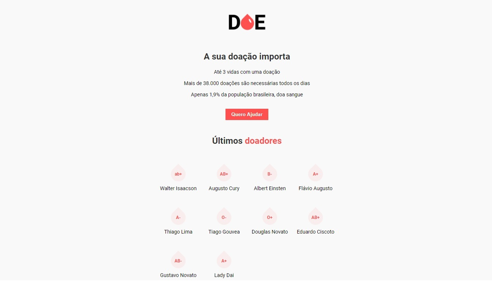
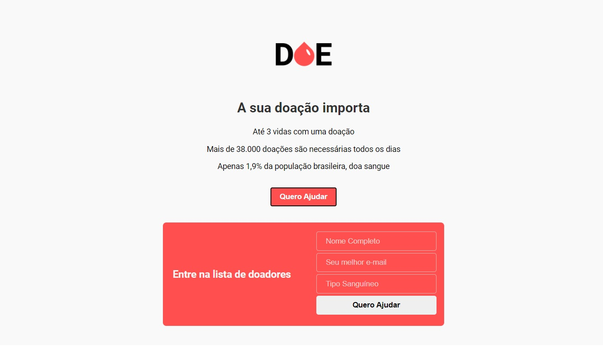

<h1 align="center">
    
</h1>

<h4 align="center"> 
  Doe Sangue! Salve vidas! 🚀
</h4> 

<p align="center">
  
  
  <a href="https://www.twitter.com/douglasabnovato/">
    
  </a>
</p>

## 💻 Sobre o projeto

♻️ Doe Sangue! Salve vidas! 

- Cadastrar pessoas para doação de sangue
- Inserir no cadastro os doares com informações úteis
- Visualizar a lista de doadores
 
## 🎨 Layout

Uma aplicação web responsiva desenvolvida em reactjs com material design lite do Google. 

### Web - v1.0

<p align="center" style="display: flex; align-items: flex-start; justify-content: center;">
  
  
</p> 

## 🛠 Tecnologias

As seguintes ferramentas foram usadas na construção do projeto:

- [Css][css]: posicionamento, dimensionamento e muito mais
- [Javascript][javascript]
- [HTML][html]: estrutura e efeitos  
- [Git][git]
- [Github][github]  
- [Node.js][nodejs]  

## 🚀 Como executar o projeto

#### Frontend 

- [x] 1. Aplicação Doe Sangue! Salve vidas!
- [x] 2. Estrutura HTML 
- [x] 3. Estilização CSS
- [x] 3.1. css donors
- [x] 3.2. css donors alinhamentos
- [x] 3.3. css donors espaçamentos
- [x] 3.4. css global
- [x] 3.5. css donors largura e altura
- [x] 3.6. css form
- [x] 3.7. css header button
- [x] 3.8. css fonts: google fonts, tamanho
- [x] 3.9. css cores 
- [x] 3.10. css cores do form e títulos
- [x] 3.11. css img - logo 
- [x] 3.12. css gota nos tipos de sangue 
- [x] 4. Lógica da Aplicação - Javascript
- [x] 4.1. js form
- [x] 4.2. js button

#### Backend

- [x] 5. Servidor da aplicação
- [x] 5.1. Regras de dados
- [x] 5.2. Banco de Dados para armazenar dados
- [x] 6. Tecnologias 
- [x] 6.1. NodeJS - LTS v12.18.3
- [x] 6.1.1. npm init -y
- [x] 6.1.2. `npm install express`: criar servidor
- [x] 6.1.3. pasta node_modules
- [x] 6.1.4. server.sj: configurar o servidor
- [x] 6.1.5. node server.js: executar o servidor
- [x] 6.1.6. nodemon: `npm install nodemon`: automatiza o restart do servidor
- [x] 6.1.6.1. warning: nodemon funcionou apenas com o yarn
- [x] 6.1.7. nunjucks: `npm install nunjucks`: template engine
- [x] 6.2. Dados
- [x] 6.2.1. Estrutura de repetição com nunjucks
- [x] 6.2.3. Pegar os dados do formulário
- [x] 6.3. Banco de Dados
- [x] 6.3.1. Postgres 
- [x] 6.3.1.1. Linguagem SQL
- [x] 6.3.1.2. SGBDR
- [x] 6.3.1.3. Open Source
- [x] 6.3.2. Instalar Postgres - 1234560 
- [x] 6.3.3. Postbird
````
    user: 'postgres',
    password: '1234560',
    host: 'localhost',
    port: 5432,
    database: 'doe'
````
- [x] 6.3.3.1. Connections
- [x] 6.3.3.2. criar db - doe
- [x] 6.3.3.3. criar tabela - donors
- [x] 6.3.3.4. criar colunas - name, email, blood com seus respectivos tipos
- [x] 6.3.3.5. inserir registros
- [x] 6.3.3.5.1. content/new row
- [x] 6.3.3.5.2. new query
````sql
insert into "donors" ("name", "email", "blood")
values ('Augusto Cury', 'augusto@cury.com.br', 'AB+');
````
- [x] 6.3.3.6. buscar dados
````sql
select *
from "donors";
````
- [x] 6.4. conectar a aplicação ao bd: `npm install pg`
- [x] 6.5. revisado estilização e db  

### Pré-requisitos

Antes de começar, você vai precisar ter instalado em sua máquina as seguintes ferramentas:
[Git](https://git-scm.com), [Node.js][nodejs]. 
Além disto é bom ter um editor para trabalhar com o código como [VSCode][vscode]

### 🧭 Código + Dependências 

- npm install express
- npm install nodemon
- npm install nunjucks
- npm install pg 

### 🧭 Rodando a aplicação web (Front End)

```bash 
# Clone este repositório
$ git clone https://github.com/douglasabnovato/doe-sangue-salve-vidas

# Acesse a pasta do projeto no seu terminal/cmd
$ cd doe-sangue-salve-vidas

# Instale as dependências
$ npm install

# Execute a aplicação em modo de desenvolvimento
$ npm run start

# A aplicação será aberta na porta:3000 - acesse http://localhost:3000

```

## 😯 Como contribuir para o projeto

1. Faça um **fork** do projeto.
2. Crie uma nova branch com as suas alterações: `git checkout -b my-feature`
3. Salve as alterações e crie uma mensagem de commit contando o que você fez: `git commit -m "feature: My new feature"`
4. Envie as suas alterações: `git push origin my-feature`
> Caso tenha alguma dúvida confira este [guia de como contribuir no GitHub](https://github.com/firstcontributions/first-contributions)


## 📝 Licença

Este projeto esta sobe a licença MIT.

Feito com ❤️ por Douglas A B Novato 👋🏽 [Entre em contato!](https://www.linkedin.com/in/douglasabnovato/)

[git]: https://git-scm.com/doc
[github]: https://docs.github.com/en
[nodejs]: https://nodejs.org/
[typescript]: https://www.typescriptlang.org/
[expo]: https://expo.io/
[reactjs]: https://reactjs.org
[rn]: https://facebook.github.io/react-native/
[yarn]: https://yarnpkg.com/
[vscode]: https://code.visualstudio.com/
[vceditconfig]: https://marketplace.visualstudio.com/items?itemName=EditorConfig.EditorConfig
[license]: https://opensource.org/licenses/MIT
[vceslint]: https://marketplace.visualstudio.com/items?itemName=dbaeumer.vscode-eslint
[prettier]: https://marketplace.visualstudio.com/items?itemName=esbenp.prettier-vscode
[rs]: https://rocketseat.com.br 
[css]: https://developer.mozilla.org/en-US/docs/Web/CSS 
[html]: https://developer.mozilla.org/en-US/docs/Web/HTML
[javascript]: https://developer.mozilla.org/en-US/docs/Web/JavaScript 

Fonte do projeto: [Mayk Brito - Maratona Dev 3.0](https://github.com/maykbrito) 